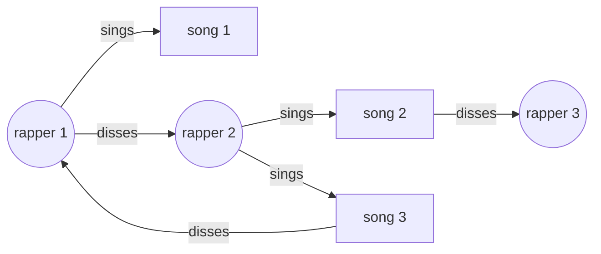

# Data Engineering Student Project
## Links between famous "diss" tracks and singers
By Meryem and Emilien

Teacher: Riccardo Tommasini
Course: Foundation of Data Engineering
[https://riccardotommasini.com/courses/2022-10-03-dataeng-insa-ot/](https://riccardotommasini.com/courses/2022-10-03-dataeng-insa-ot/)

## Project Presentation
### Subject
We wanted to work on data around music, and as we like rap we found interesting to study diss tracks (songs in which rappers generally attack another rapper), as they link together rappers and songs. We thought that with information about the relations between diss tracks and rappers, we could create a visual network of "dissing".

Something like this:

Questions we would like to answer:
- Who are those who get dissed the most ?
- Who are the rappers that diss the most ?

## Data sources
The first intuition was to look inside the lyrics from known diss tracks to find mentions from another artist.
But we faced multiple challenges with that approach:
1. The lyrics are not always easy to find, as they are almost never stored with song data.
2. After we retrieved the lyrics somehow (probably using an API like [api.chartlyrics.com](http://api.chartlyrics.com/apiv1.asmx?op=SearchLyricDirect)), we would need to analyse them to match other persons (artists) with another API like [DBPedia Spotlight](https://demo.dbpedia-spotlight.org/)
3. **The most problematic one**: It is pretty rare that the lyrics mention explicitely and precisely the name of the person or group of persons dissed by the song. Most of the time, the reference is implicit.

For those reasons we took another approach. We searched online for lists of diss tracks which contain references of the targets.
1. We found out that there is a well-stocked list [on Wikipedia](https://en.wikipedia.org/wiki/List_of_diss_tracks)
2. We also search DBPedia for diss tracks using SPARQL request
3. We enrich information about the songs we retrieved with more data from DBPedia
