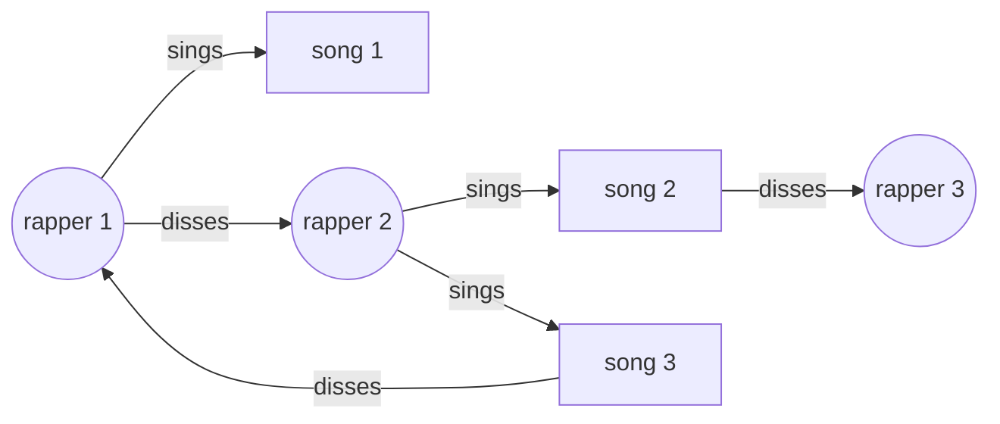

# Data Engineering Student Project

### Links between famous "diss" tracks and singers

By Meryem and Emilien

Teacher: Riccardo Tommasini

Course: Foundation of Data Engineering
[https://riccardotommasini.com/courses/2022-10-03-dataeng-insa-ot/](https://riccardotommasini.com/courses/2022-10-03-dataeng-insa-ot/)

# Project Presentation

### Subject

We wanted to work on data around music, and as we like rap we found interesting to study diss tracks (songs in which rappers generally attack another rapper), as they link together rappers and songs. We thought that with information about the relations between diss tracks and rappers, we could create a visual network of "dissing".

Something like this:

### Questions we would like to answer:

- Who are those who get dissed the most ?
- Who are the rappers that diss the most ?

# Data sources

The first intuition was to look inside the lyrics from known diss tracks to find mentions from another artist.
But we faced multiple challenges with that approach:

1. The lyrics are not always easy to find, as they are almost never stored with song data.
2. After we retrieved the lyrics somehow (probably using an API like [api.chartlyrics.com](http://api.chartlyrics.com/apiv1.asmx?op=SearchLyricDirect)), we would need to analyse them to match other persons (artists) with another API like [DBPedia Spotlight](https://demo.dbpedia-spotlight.org/)
3. **The most problematic one**: It is pretty rare that the lyrics mention explicitely and precisely the name of the person or group of persons dissed by the song. Most of the time, the reference is implicit.

For those reasons we took another approach. We searched online for lists of diss tracks which contain references of the targets.

1. We found out that there is a well-stocked list [on Wikipedia](https://en.wikipedia.org/wiki/List_of_diss_tracks)
2. We also search DBPedia for diss tracks using SPARQL request
3. We enrich information about the songs we retrieved with more data from DBPedia

# Wrangling

Structure of the data we want to have in our staging area (in Postgres database):

### Persons/Organization Table

| ID  | Name            | Type    | Wikipedia endpoint    | Wikidata ID |
| --- | --------------- | ------- | --------------------- | ----------- |
| 13  | Queen           | Group   | /wiki/Queen_(Group)   | 2345        |
| 31  | Eminem          | Artist  | /wiki/Eminem          | 3456        |
| 83  | United Airlines | Company | /wiki/United_Airlines | 4567        |

### Song Table

| ID  | Date              | Title                 | Artist       | Target          | Response to                                                                 | Wikidata ID | Artist ID | Target ID |
| --- | ----------------- | --------------------- | ------------ | --------------- | --------------------------------------------------------------------------- | ----------- | --------- | --------- |
| 7   | 1971              | How Do You Sleep ?    | John Lennon  | Paul McCartney  | Personal slights Lennon felt McCartney made on the latter's album Ram       | Q2453037    | 7         | 8         |
| 37  | February 12, 1998 | '97 Bonnie & Clyde    | Eminem       | Kim Mathers     |                                                                             | Q4540403    | 31        | 35        |
| 87  | July 6, 2009      | United Breaks Guitars | Dave Carroll | United Airlines | United Airlines employees breaking Carroll's guitar while on board a flight | Q1567288    | 78        | 83        |

# Project steps

## Ingestion phase

The first dag is responsible for collecting the data. The choice that was made was to retrieve the data from dbpedia, wikipedia and wikidata. The down half of the picture shows how the data is collected : 
- Disstracks and their metadata are retrieved from dbpedia. They're simply saved to mongodb.
- A disstrack list is scrapped from wikipedia, for each one of them, their wikipedia page is scrapped to find the wikidata id and metadata is retrieved from there. The node 'wikipedia_list' scraps the wikipedia list and the wikipedia pages. The node 'wikidata_metadata' gets the additional metadata from wikidata. Everything is lastly stored in mongodb.

A node can be noticed at the beginning, it's use is to ping Google and check for connection availability. In case connection is available, then the steps just described are the only ones executed. In the other case, the upper part of the picture will be the executed one. It'll simply load the data from local files. These files are updated each time the normal part of the pipeline is executed. We can say that it loads the latest version of the data.

Nb: All the steps communicate through redis to be more efficient by using cache.

## Wrangling phase

We have two very different data sources : Wikidata and DBPedia. That pipeline will merge them to have coherent data and cleanse them.
It extracts the data from MongoDB and stores it in PostgreSQL using Redis in between.
The main tool used here is obviously Pandas as it provides with very efficient tools for data wrangling given that we can understand them.

## Production phase

...